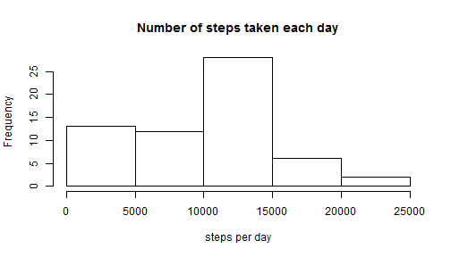
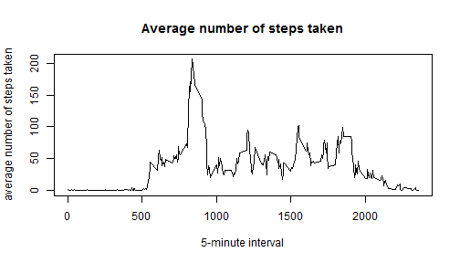
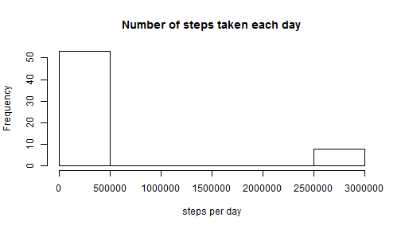
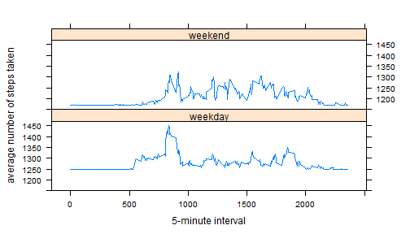

## Markdown Peer-graded Assignment


### 1. Download and Read the Dataset


```r
fileUrl = "https://d396qusza40orc.cloudfront.net/repdata%2Fdata%2Factivity.zip"
temp <- tempfile()
download.file(fileUrl, temp)
unzip(temp)
unlink(temp)

activity <- read.csv("activity.csv")
```


### 2. Histogram of the number of steps taken each day


```r
stepsperday <- aggregate(activity$steps, by=list(date=activity$date), FUN=sum, na.rm=TRUE)
colnames(stepsperday)[2] <- "steps"
hist(stepsperday$steps, main="Number of steps taken each day", xlab = "steps per day")
```




### 3. Mean and median number of steps taken each day


```r
meansteps <- mean(stepsperday$steps, na.rm = TRUE)
mediansteps <- median(stepsperday$steps, na.rm=TRUE)
```

The mean of the total number of steps taken per day is 9354.2295082  
The median of the total number of steps taken per day is 10395


### 4. Time series plot of the average number of steps taken


```r
stepsperinterval <- aggregate(activity$steps, by=list(interval=activity$interval), FUN=mean, na.rm=TRUE)
colnames(stepsperinterval)[2] <- "meansteps"
with(stepsperinterval, plot(interval, meansteps, type="l", main = "Average number of steps taken", xlab = "5-minute interval", ylab = "average number of steps taken"))
```




### 5. The 5-minute interval that, on average, contains the maximum number of steps


```r
maxinterval <- stepsperinterval[which.max(stepsperinterval$meansteps),"interval"]
```

The 5-minute interval -- 835, on average across all the days in the dataset, contains the maximum number of steps.


### 6. Total number of missing values in the dataset


```r
totalNA <- sum(is.na(activity$steps))
print(totalNA)
```

```
## [1] 2304
```

The total number of missing values in the dataset is 2304


### 7. Fill in all NAs in the dataset and create a new dataset with NAs filled in

Fill in the NAs with the meansteps and create a new dataset "newactivity"


```r
activity2 <- activity
activity2[is.na(activity2$steps),"steps"] <- meansteps
```


### 8. Histogram of the total number of steps taken each day after missing values are imputed


```r
stepsperday2 <- aggregate(activity2$steps, by=list(date=activity2$date), FUN=sum, na.rm=TRUE)
colnames(stepsperday2)[2] <- "steps"
hist(stepsperday2$steps, main="Number of steps taken each day", xlab = "steps per day")
```




```r
meansteps2 <- mean(stepsperday2$steps, na.rm = TRUE)
mediansteps2 <- median(stepsperday2$steps, na.rm=TRUE)
```

The mean of the total number of steps taken per day is 3.6266808 &times; 10<sup>5</sup>  
The median of the total number of steps taken per day is 1.1458 &times; 10<sup>4</sup>


### 9. Panel plot comparing the average number of steps taken per 5-minute interval across weekdays and weekends

Create a new factor variable "weekdayindex" to indicate whether it's weekday or weekend day


```r
activity2$date <- as.Date(activity2$date)
activity2$day <- weekdays(activity2$date)
for(i in 1:17568){
      if(activity2$day[i] %in% c("Saturday","Sunday")){
            activity2$weekdayindex[i] <- "weekend"
      } else {
            activity2$weekdayindex[i] <- "weekday"
      }
}
activity2$weekdayindex <- as.factor(activity2$weekdayindex)
```

Make a panel plot


```r
stepsperinterval2 <- aggregate(activity2$steps, by=list(activity2$interval, activity2$weekdayindex), FUN=mean, na.rm=TRUE)
colnames(stepsperinterval2) <- c("interval","weekdayindex","meansteps")
library(lattice)
xyplot(meansteps~interval|weekdayindex,data=stepsperinterval2, layout=c(1,2), type="l", xlab = "5-minute interval", ylab = "average number of steps taken")
```


